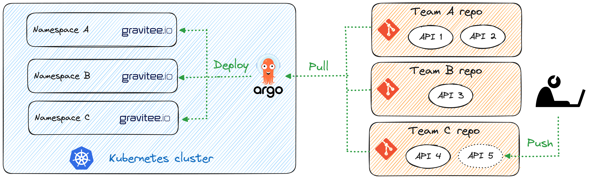

# GitOps for API management with Gravitee and ArgoCD

GitOps for API management, sometimes known as APIOps, refers to the use of sofware development practices to implement your company's API management strategy. This way, you can expect increased levels of automation, reliability, and scale. 

This approach is particularly well suited to being impemented in conjunction with Kubernetes. Key parts of this approach are:

* using structured text files (i.e. code) to define the desired state of the system declaratively
* using source control systems like git to version and collaborated on those files
* using CI/CD automation to ensure the latest changes to version control are reflected in the API platform.

The below diagram illustrates an example implementation of GitOps for API management with Gravitee. Imagine an organization with multiple teams of API publishers, that are all sharing a common infrastructure but want isolation across teams. Each team would have their own git repository for storing and collaborating on their API definitions. These take the form of Gravitee Custom Resource definitions for Kubernetes. API definitions are automatically deployed to Kubernetes using ArgoCD. On the cluster, dedicated namespaces have been created for each team, and each namespace is enabled with the Gravitee stack which includes:

* the Gravitee Kubernetes Operator (GKO), which listens for Gravitee custom resources like API definitions
* instances of the Gravitee API Gateway, whose configuration is provided to it by the Gravitee Kubernetes Operator



Let's take a look step by step at what is required to implement a simplified version of this. It should give you a feel for the power and elegance of this approach.

# Setting up

There are a few prerequisites to getting this example working. 

* a Kubernetes cluster and kubectl
* Gravitee installed on the cluster. At minimum, a Gravitee gateway running on the cluster and configured to sync its API configurations from Kubernetes. The most minimal setup here is to use the gateway in db-less mode. Optionally, the full Gravitee API management platform, either running locally on the cluster or elsewhere (so long as at least one gateway is running on the cluster)
* Gravitee Kubernetes Operator (GKO) is installed on the cluster
* ArgoCD is installed on the cluster

In this example, we'll use ArgoCD via its CLI, without needing to open the user interface. This is the simplest setup to get started quickly. Later if you're interested you can also setup the ArgoCD UI. For more on getting started with ArgoCD, head to the official ArgoCD [getting started guide](https://argo-cd.readthedocs.io/en/stable/getting_started/).

```sh
kubectl create namespace argocd
kubectl apply -n argocd -f https://raw.githubusercontent.com/argoproj/argo-cd/stable/manifests/core-install.yaml
```

We'll install the ArgoCD CLI to interact more easily with Argo on our cluster. We'll also login to the ArgoCD installation with the CLI. 

```sh
brew install argocd
argocd login --core
```

Now we can start building ArgoCD applications, which are the unit of deployment that ArgoCD will track. An application points to a repository that contains the Kubernetes manifests for the resources that we want to deploy. In this case, we'll point to https://github.com/jmcx/gravitee-quickstart.git that contains some example API CRDs that we can deploy. 

By default, ArgoCD CLI expects you to be in the argocd namespace in order to be able to run Argo commands (I’m using the handy tools kubectx+kubens to switch namespaces).

I’ll also make sure a Gravitee namespace is available which is where I’ll create my API definitions.

```sh
% kubectl create namespace gravitee
namespace/gravitee created

% kubens argocd 
Context "minikube" modified.
Active namespace is "argocd".

argocd app create graviteegitopsapis --repo https://github.com/jmcx/gravitee-quickstart.git --path 05_GitOps_ArgoCD/resources --dest-server https://kubernetes.default.svc --dest-namespace gravitee
application 'graviteegitopsapis' created
```
Once we’ve created an ArgoCD application, we can check its status by getting the application. What we’ll see is that the application is out of sync, because we haven’t yet told ArgoCD to sync it. It’ll even list the resources that aren’t synced, in this case the three Gravitee APIs that are waiting to be deployed.

```sh
% argocd app get graviteegitopsapis 
Name:               argocd/graviteegitopsapis
Project:            default
Server:             https://kubernetes.default.svc
Namespace:          gravitee
URL:                http://localhost:57336/applications/graviteegitopsapis
Repo:               https://github.com/jmcx/gravitee-quickstart.git
Target:             
Path:               05_GitOps_ArgoCD/resources
SyncWindow:         Sync Allowed
Sync Policy:        <none>
Sync Status:        OutOfSync from  (e0fb941)
Health Status:      Healthy

GROUP        KIND           NAMESPACE  NAME                   STATUS     HEALTH   HOOK  MESSAGE
gravitee.io  ApiDefinition  gravitee   corporate-banking-api  OutOfSync  Missing        
gravitee.io  ApiDefinition  gravitee   credit-card-api        OutOfSync  Missing        
gravitee.io  ApiDefinition  gravitee   investment-banking     OutOfSync  Missing 
```

Now let’s sync the app so that ArgoCD knows to reconcile the state of what is in the Git repo with what is on the cluster.

```sh
% argocd app sync graviteegitopsapis
TIMESTAMP                  GROUP              KIND      NAMESPACE                  NAME     STATUS    HEALTH        HOOK  MESSAGE
2024-04-22T22:02:42+02:00  gravitee.io  ApiDefinition    gravitee  corporate-banking-api  OutOfSync  Missing              
2024-04-22T22:02:42+02:00  gravitee.io  ApiDefinition    gravitee       credit-card-api   OutOfSync  Missing              
2024-04-22T22:02:42+02:00  gravitee.io  ApiDefinition    gravitee    investment-banking   OutOfSync  Missing              
[truncated]
GROUP        KIND           NAMESPACE  NAME                   STATUS  HEALTH  HOOK  MESSAGE
gravitee.io  ApiDefinition  gravitee   investment-banking     Synced                apidefinition.gravitee.io/investment-banking created
gravitee.io  ApiDefinition  gravitee   credit-card-api        Synced                apidefinition.gravitee.io/credit-card-api created
gravitee.io  ApiDefinition  gravitee   corporate-banking-api  Synced                apidefinition.gravitee.io/corporate-banking-api created
```

I can now see that my APIs have been created:

```sh
% kubectl get apidefinitions.gravitee.io -n gravitee 
NAME                    ENTRYPOINT             ENDPOINT                       VERSION
corporate-banking-api   /corporate/            https://api.gravitee.io/echo   1
credit-card-api         /credit-card           https://api.gravitee.io/echo   1
investment-banking      /investment-banking/   https://api.gravitee.io/echo   1
```

Because these API resources have the local flag set to true, GKO will know to create configMaps in the cluster that the API gateway can use to load its configuration:

```sh
% kubectl get configmaps -n gravitee
NAME                                                DATA   AGE
corporate-banking-api                               4      5s
credit-card-api                                     4      5s
investment-banking                                  4      5s
```

I can now test that these APIs are reaching on my gateway by invoking them with any HTTP client, such as curl for instance:


```sh
% curl apim.example.com/gateway/credit-card                                                                                                                                                           
{"headers":{"Host":"api.gravitee.io","Accept":"*/*","User-Agent":"curl/8.4.0","X-Forwarded-Host":"apim.example.com","X-Forwarded-Scheme":"http","X-Gravitee-Request-Id":"8fb3ebee-eb77-4fa4-b3eb-eeeb778fa4e4","X-Gravitee-Transaction-Id":"fd8bbd27-581e-4477-8bbd-27581ec4774f","X-Real-IP":"10.244.0.1","X-Request-ID":"af2d5cd7a938f561dec2f10dd2f41316","X-Scheme":"http","accept-encoding":"deflate, gzip"},"query_params":{},"bodySize":0}%   
```

```sh
% curl apim.example.com/gateway/investment-banking
{"headers":{"Host":"api.gravitee.io","Accept":"*/*","User-Agent":"curl/8.4.0","X-Forwarded-Host":"apim.example.com","X-Forwarded-Scheme":"http","X-Gravitee-Request-Id":"e98b58ea-5fd7-4df6-8b58-ea5fd76df641","X-Gravitee-Transaction-Id":"86e7733a-606e-467b-a773-3a606e667b81","X-Real-IP":"10.244.0.1","X-Request-ID":"6c7c70f310c80e6e51afe50f37c39bb5","X-Scheme":"http","accept-encoding":"deflate, gzip"},"query_params":{},"bodySize":0}% 
```

```sh
% curl apim.example.com/gateway/corporate         
{"message":"Unauthorized","http_status_code":401}%
```

These APIs are all pointing to an echo service as a backend, which is why they are replying back with metadata about the request. Except the last one which is answering with a 401 Unauthorized! Lets check the corporate banking API’s manifest to see why that might be:

```sh
% kubectl describe apidefinitions.gravitee.io corporate-banking-api -n gravitee
Name:         corporate-banking-api
Namespace:    gravitee
…
  lifecycle_state:  CREATED
  Local:            true
  Name:             Corporate, Commercial & International Banking APIs
  Plans:
    Description:  API Key plan
    Name:         API Key plan
    Security:     API_KEY
    Status:       PUBLISHED
    Type:         API
    Validation:   MANUAL
  Proxy:
    Groups:
      Endpoints:
        Name:    default
        Target:  https://api.gravitee.io/echo
        Type:    http
      load_balancing:
        Type:  ROUND_ROBIN
      Name:    default-group
    virtual_hosts:
      Path:    /corporate/
  State:       STARTED
  Version:     1
  Visibility:  PRIVATE
…
```

Of course! That API has an API key plan, and I haven’t subscribed to it yet so I can’t access it.

# More automation, more reliability

Now that we have three API definitions versioned in Git that are synced to my cluster, it is very easy for me to collaborate with team members on changes to these API definitions in a way that very much resembles a software development lifecycle:

Changes to the APIs can be made as pull requests on the repository that other team members can review and approve/reject
The history of changes is visible at all times and can be rolled back to a previous state easily
Entire new environments can be spun up very quickly with all these API loaded and ready, even if the numbers of APIs creep into the hundreds or thousands.
APIs can be promoted across environments like development, staging and production in a controlled and automated manner.

There are infinite topologies that you can choose from to best match your organizational needs, from sharing Git repos to splitting across repos, sharing Kubernetes clusters or namespaces vs having dedicated clusters, etc.

